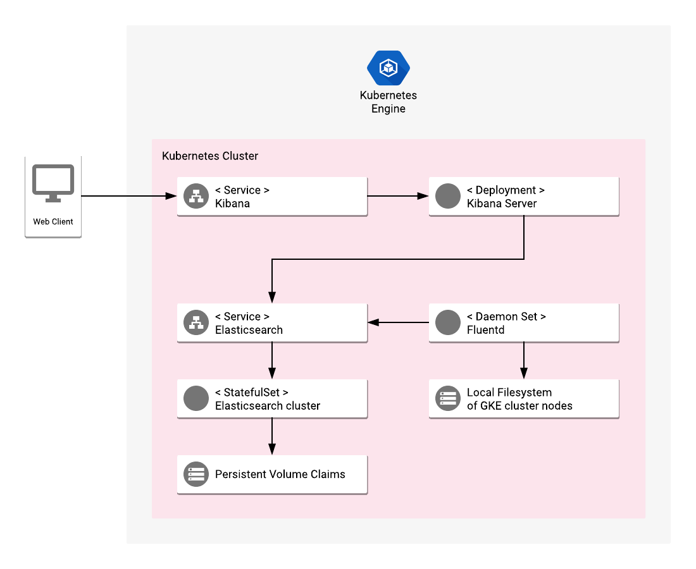

# Overview

Elastic GKE Logging is an application that provides a fully functional solution
for collecting and analyzing logs from a Kubernetes cluster. It is built on
popular open-source systems, including Fluentd for collecting logs, and
Elasticsearch with Kibana for searching and analyzing data.

[Learn more](https://www.elastic.co/).

## About Google Click to Deploy

Popular open stacks on Kubernetes packaged by Google.

## Architecture



The application is collects and presents log messages from a GKE cluster. It
consists of the following components:

*   **Fluentd DaemonSet** - collects logs from each Kubernetes node in a cluster
    and exports them to Elasticsearch.
*   **Elasticsearch StatefulSet** - a database for storing and searching the
    logs.
*   **Kibana Deployment** - a visualization tool connected to Elasticsearch for
    presenting and querying the logs.

None of the components is designed to be exposed publicly or autoscale if more
resources are needed.

## Configuration of the components

**Fluentd** - contains a ConfigMap that defines files for the locations and
formats of logs. It exports logs to the Elasticsearch daily indexes, starting
with `logstash-\*` prefix.

**Elasticsearch** - forms a cluster with a configurable number of replicas
(specified by user before the installation). The image uses a dedicated disk
(VolumeClaim) for storing data statefully.

**Kibana** - stores all the configuration in Elasticsearch index. Kibana itself
is installed in a single-replica, stateless Deployment. Kibana's initial
configuration consists of JSON payloads that are used with Kibana's REST API to
set an index pattern for `logstash-\*`, and some useful saved searches.

# Installation

## Quick install with Google Cloud Marketplace

Get up and running with a few clicks! Install this Elastic GKE Logging app to a
Google Kubernetes Engine cluster using Google Cloud Marketplace. Follow the
[on-screen instructions](https://console.cloud.google.com/marketplace/details/google/elastic-gke-logging).

## Command line instructions

You can use [Google Cloud Shell](https://cloud.google.com/shell/) or a local
workstation to complete the following steps.

[](https://console.cloud.google.com/cloudshell/editor?cloudshell_git_repo=https://github.com/GoogleCloudPlatform/click-to-deploy&cloudshell_open_in_editor=README.md&cloudshell_working_dir=k8s/elastic-gke-logging)

### Prerequisites

#### Set up command-line tools

You'll need the following tools in your development environment. If you are
using Cloud Shell, `gcloud`, `kubectl`, Docker, and Git are installed in your
environment by default.

-   [gcloud](https://cloud.google.com/sdk/gcloud/)
-   [kubectl](https://kubernetes.io/docs/reference/kubectl/overview/)
-   [docker](https://docs.docker.com/install/)
-   [git](https://git-scm.com/book/en/v2/Getting-Started-Installing-Git)
-   [helm](https://helm.sh/)

Let's create exports file to handle all env vars

```shell
nano exports
```

content:
```shell
export CLUSTER=elastic-gke-logging-cluster
export ZONE=europe-west4-a
export APP_INSTANCE_NAME=elastic-logging-1
export NAMESPACE=default
export ELASTICSEARCH_REPLICAS=2
export METRICS_EXPORTER_ENABLED=false
export TAG=6.3
export IMAGE_ELASTICSEARCH="marketplace.gcr.io/google/elastic-gke-logging"
export IMAGE_KIBANA="marketplace.gcr.io/google/elastic-gke-logging/kibana:${TAG}"
export IMAGE_FLUENTD="marketplace.gcr.io/google/elastic-gke-logging/fluentd:${TAG}"
export IMAGE_INIT="marketplace.gcr.io/google/elastic-gke-logging/ubuntu16_04:${TAG}"
export IMAGE_METRICS_EXPORTER="marketplace.gcr.io/google/elastic-gke-logging/prometheus-to-sd:${TAG}"
export FLUENTD_SERVICE_ACCOUNT="$APP_INSTANCE_NAME-fluentdserviceaccount"
```

and source it

```shell
source exports
```

Configure gcloud to use proper project / zone / region

```shell
gcloud config set project <ip_testing>
gcloud config set compute/zone europe-west4-a
gcloud config set compute/region europe-west4
```

Configure `gcloud` as a Docker credential helper:

```shell
gcloud auth configure-docker
```

#### Create a Google Kubernetes Engine cluster

Create a new cluster from the command line:

```shell
gcloud container clusters create $CLUSTER \
  --cluster-version latest \
  --machine-type=n1-standard-2 \
  --num-nodes 4 \
  --zone $ZONE 
```

Configure `kubectl` to connect to the new cluster:

```shell
gcloud container clusters get-credentials "$CLUSTER" --zone "$ZONE"
```

#### Clone this repo

Clone this repo and the associated tools repo:

```shell
git clone --recursive https://github.com/GoogleCloudPlatform/click-to-deploy.git
```

#### Install the Application resource definition (custom resource definitions)

An Application resource is a collection of individual Kubernetes components,
such as Services, Deployments, and so on, that you can manage as a group.

To set up your cluster to understand Application resources, run the following
command:

```shell
kubectl apply -f "https://raw.githubusercontent.com/GoogleCloudPlatform/marketplace-k8s-app-tools/master/crd/app-crd.yaml"
```

You need to run this command once.

The Application resource is defined by the
[Kubernetes SIG-apps](https://github.com/kubernetes/community/tree/master/sig-apps)
community. The source code can be found on
[github.com/kubernetes-sigs/application](https://github.com/kubernetes-sigs/application).

### Install the Application

Navigate to the `elastic-gke-logging` directory:

```shell
cd click-to-deploy/k8s/elastic-gke-logging
```

Configure the container images:

We recommend
that you pin each image to an immutable
[content digest](https://docs.docker.com/registry/spec/api/#content-digests).
This ensures that the installed application always uses the same images, until
you are ready to upgrade. To get the digest for the image, use the following
script:

```shell
for i in IMAGE_ELASTICSEARCH IMAGE_KIBANA IMAGE_FLUENTD IMAGE_INIT IMAGE_METRICS_EXPORTER; do
  repo=$(echo ${!i} | cut -d: -f1);
  digest=$(docker pull ${!i} | sed -n -e 's/Digest: //p');
  export $i="$repo@$digest";
  env | grep $i;
done
```

#### Create the Fluentd Service Account

Create Fluentd Service Account and ClusterRoleBinding:

```shell
kubectl create serviceaccount $FLUENTD_SERVICE_ACCOUNT --namespace $NAMESPACE
kubectl create clusterrole $FLUENTD_SERVICE_ACCOUNT-role --verb=get,list,watch --resource=pods,namespaces
kubectl create clusterrolebinding $FLUENTD_SERVICE_ACCOUNT-rule --clusterrole=$FLUENTD_SERVICE_ACCOUNT-role --serviceaccount=$NAMESPACE:$FLUENTD_SERVICE_ACCOUNT
```

#### Expand the manifest template

Use `helm template` to expand the template. We recommend that you save the
expanded manifest file for future updates to the application.

```shell
helm template chart/elastic-gke-logging \
--name $APP_INSTANCE_NAME \
--namespace $NAMESPACE \
--set elasticsearch.replicas=$ELASTICSEARCH_REPLICAS \
--set fluentd.serviceAccount=$FLUENTD_SERVICE_ACCOUNT \
--set initImage=$IMAGE_INIT \
--set elasticsearch.image.repo=$IMAGE_ELASTICSEARCH \
--set elasticsearch.image.tag=$TAG \
--set kibana.image=$IMAGE_KIBANA \
--set fluentd.image=$IMAGE_FLUENTD \
--set metrics.image=$IMAGE_METRICS_EXPORTER \
--set metrics.enabled=$METRICS_EXPORTER_ENABLED > "${APP_INSTANCE_NAME}_manifest.yaml"
```

#### Apply the manifest to your Kubernetes cluster

Use `kubectl` to apply the manifest to your Kubernetes cluster:

```shell
kubectl apply -f "${APP_INSTANCE_NAME}_manifest.yaml" --namespace "${NAMESPACE}"
```

> NOTE: Elasticsearch Pods have an
> [Init Container](https://kubernetes.io/docs/concepts/workloads/pods/init-containers/)
> that sets the system property of `vm.max_map_count` set to at least `262144`
> on the hosting node. For background information, see the
> [Elasticsearch documentation](https://www.elastic.co/guide/en/elasticsearch/reference/current/vm-max-map-count.html).

#### View the app in the Google Cloud Platform Console

To get the GCP Console URL for your app, run the following command:

```shell
echo "https://console.cloud.google.com/kubernetes/application/${ZONE}/${CLUSTER}/${NAMESPACE}/${APP_INSTANCE_NAME}"
```

To view your app, open the URL in your browser.

### Make the Elasticsearch and Kibana services externally available

By default, the application does not have an external IP. To expose an external
IP for Elasticsearch service, run the following command:

```
kubectl patch svc "$APP_INSTANCE_NAME-elasticsearch-svc" \
  --namespace "$NAMESPACE" \
  --patch '{"spec": {"type": "LoadBalancer"}}'
```

To create an external IP address for the Kibana service, run:

```
kubectl patch svc "$APP_INSTANCE_NAME-kibana-svc" \
  --namespace "$NAMESPACE" \
  --patch '{"spec": {"type": "LoadBalancer"}}'
```

# Get the Elasticsearch URL

If you run your Elasticsearch cluster behind a LoadBalancer service, get the
service IP to run administrative operations against the REST API:

```
export SERVICE_IP=$(kubectl get svc $APP_INSTANCE_NAME-elasticsearch-svc \
  --namespace $NAMESPACE \
  --output jsonpath='{.status.loadBalancer.ingress[0].ip}')

export ELASTIC_URL="http://${SERVICE_IP}:9200"
```

It might take some time for the external IP address to be created.

Verify the variable using `curl`:

```shell
curl "${ELASTIC_URL}"
```

In the response, you should see a message that has Elasticsearch's tagline:

```shell
"tagline" : "You Know, for Search"
```

# Get the Kibana URL

To get the URL for Kibana, follow the same steps as for Elasticsearch.

If you want to expose the Kibana service externally, run the following command:

```shell
export SERVICE_IP=$(kubectl get svc $APP_INSTANCE_NAME-kibana-svc \
  --namespace $NAMESPACE \
  --output jsonpath='{.status.loadBalancer.ingress[0].ip}')

export KIBANA_URL="http://${SERVICE_IP}:5601"
```

# Getting Istio
```bash
curl -L https://istio.io/downloadIstio | sh -
cd istio-1.4.1
export PATH=$PWD/bin:$PATH
```

# Install the demo profile
```bash
istioctl manifest apply --set profile=demo
```

Verify the installation by ensuring the following Kubernetes services are deployed and verify they all have an appropriate CLUSTER-IP except the jaeger-agent service:
```bash
$ kubectl get svc -n istio-system
NAME                     TYPE           CLUSTER-IP       EXTERNAL-IP     PORT(S)                                                                                                                                      AGE
grafana                  ClusterIP      172.21.211.123   <none>          3000/TCP                                                                                                                                     2m
istio-citadel            ClusterIP      172.21.177.222   <none>          8060/TCP,15014/TCP                                                                                                                           2m
istio-egressgateway      ClusterIP      172.21.113.24    <none>          80/TCP,443/TCP,15443/TCP                                                                                                                     2m
istio-galley             ClusterIP      172.21.132.247   <none>          443/TCP,15014/TCP,9901/TCP                                                                                                                   2m
istio-ingressgateway     LoadBalancer   172.21.144.254   52.116.22.242   15020:31831/TCP,80:31380/TCP,443:31390/TCP,31400:31400/TCP,15029:30318/TCP,15030:32645/TCP,15031:31933/TCP,15032:31188/TCP,15443:30838/TCP   2m
istio-pilot              ClusterIP      172.21.105.205   <none>          15010/TCP,15011/TCP,8080/TCP,15014/TCP                                                                                                       2m
istio-policy             ClusterIP      172.21.14.236    <none>          9091/TCP,15004/TCP,15014/TCP                                                                                                                 2m
istio-sidecar-injector   ClusterIP      172.21.155.47    <none>          443/TCP,15014/TCP                                                                                                                            2m
istio-telemetry          ClusterIP      172.21.196.79    <none>          9091/TCP,15004/TCP,15014/TCP,42422/TCP                                                                                                       2m
jaeger-agent             ClusterIP      None             <none>          5775/UDP,6831/UDP,6832/UDP                                                                                                                   2m
jaeger-collector         ClusterIP      172.21.135.51    <none>          14267/TCP,14268/TCP                                                                                                                          2m
jaeger-query             ClusterIP      172.21.26.187    <none>          16686/TCP                                                                                                                                    2m
kiali                    ClusterIP      172.21.155.201   <none>          20001/TCP                                                                                                                                    2m
prometheus               ClusterIP      172.21.63.159    <none>          9090/TCP                                                                                                                                     2m
tracing                  ClusterIP      172.21.2.245     <none>          80/TCP                                                                                                                                       2m
zipkin                   ClusterIP      172.21.182.245   <none>          9411/TCP                                                                                                                                     2m

```

# Deploying test application

```shell
kubectl label namespace default istio-injection=enabled
wget https://raw.githubusercontent.com/istio/istio/release-1.4/samples/bookinfo/platform/kube/bookinfo.yaml
kubectl apply -f bookinfo.yaml
```
# Verifying services

```shell
kubectl get services
```
```bash
NAME                                           TYPE           CLUSTER-IP     EXTERNAL-IP    PORT(S)                         AGE
details                                        ClusterIP      10.3.245.252   <none>         9080/TCP                        14s
kubernetes                                     ClusterIP      10.3.240.1     <none>         443/TCP                         151m
productpage                                    ClusterIP      10.3.245.123   <none>         9080/TCP                        12s
ratings                                        ClusterIP      10.3.250.1     <none>         9080/TCP                        13s
reviews                                        ClusterIP      10.3.248.112   <none>         9080/TCP                        13s
```

# Veryifying pods
```shell
kubectl get pods
```
```bash
details-v1-68fbb76fc-xhqvs                  1/1     Running     0          46s
productpage-v1-6c6c87ffff-s9mdw             1/1     Running     0          45s
ratings-v1-7bdfd65ccc-bkpkj                 1/1     Running     0          46s
reviews-v1-5c5b7b9f8d-wp5zk                 1/1     Running     0          46s
reviews-v2-569796655b-p68gr                 1/1     Running     0          46s
reviews-v3-844bc59d88-r4wxx                 1/1     Running     0          45s
```
# Validate it's actually working
```shell
kubectl exec -it $(kubectl get pod -l app=ratings -o jsonpath='{.items[0].metadata.name}') -c ratings -- curl productpage:9080/productpage | grep -o "<title>.*</title>"
```

# Create gateway
```shell
wget https://raw.githubusercontent.com/istio/istio/release-1.4/samples/bookinfo/networking/bookinfo-gateway.yaml
kubectl apply -f bookinfo-gateway.yaml
```

# Confirm the gateway has been created:

```bash
$ kubectl get gateway
NAME               AGE
bookinfo-gateway   32s
```

# Set the ingress IP and ports:

```bash
export INGRESS_HOST=$(kubectl -n istio-system get service istio-ingressgateway -o jsonpath='{.status.loadBalancer.ingress[0].ip}')
export INGRESS_PORT=$(kubectl -n istio-system get service istio-ingressgateway -o jsonpath='{.spec.ports[?(@.name=="http2")].port}')
export SECURE_INGRESS_PORT=$(kubectl -n istio-system get service istio-ingressgateway -o jsonpath='{.spec.ports[?(@.name=="https")].port}')
```

# Set GATEWAY_URL:

```bash
export GATEWAY_URL=$INGRESS_HOST:$INGRESS_PORT
```


# To confirm that the Bookinfo application is accessible from outside the cluster, run the following curl command:

```bash
curl -s http://${GATEWAY_URL}/productpage | grep -o "<title>.*</title>"
```

# Application metrics

## Index Pattern

Your installation includes a default index patten to be tracked by Kibana. The
index pattern matches the Fluentd DaemonSet configuration and is `logstash-*`.

After you have installed the app, open the Kibana UI, and in the main menu,
click **Discover**.

To get the direct URL for the Discover page, run:

```shell
echo "${KIBANA_URL}/app/kibana#/discover"
```

## Saved searches

To see the searches included with this installation of Kibana, open the Discover
page, and in the top menu, click **Open**. The list of searches includes logs
from Google Kubernetes Engine apps, Kubelet, Docker, `kernel`, and others.

### Scale the Elasticsearch cluster

Scale the number of master node replicas by the following command:

```
kubectl scale statefulsets "$APP_INSTANCE_NAME-elasticsearch" \
  --namespace "$NAMESPACE" --replicas=[NEW_REPLICAS]
```

By default, there are 2 replicas to satisfy the minimum master quorum. To
increase resilience, we recommend that you scale the number of replicas to at
least 3.

For more information about scaling StatefulSets, see the
[Kubernetes documentation](https://kubernetes.io/docs/tasks/run-application/scale-stateful-set/#kubectl-scale).
